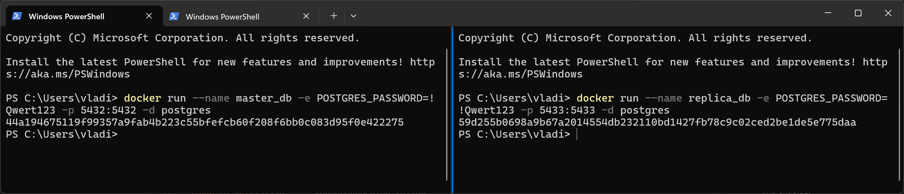
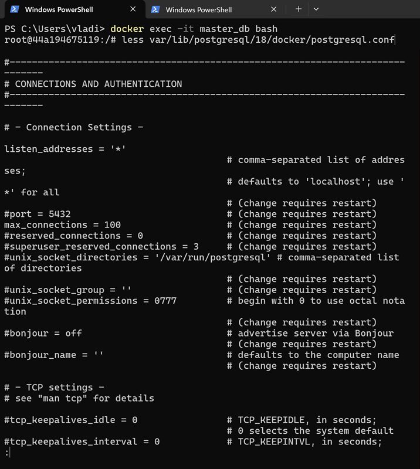
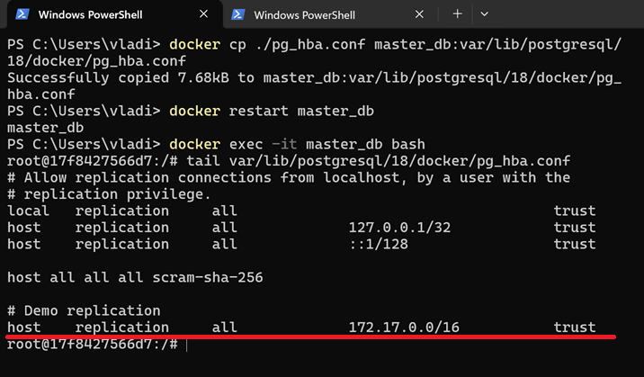
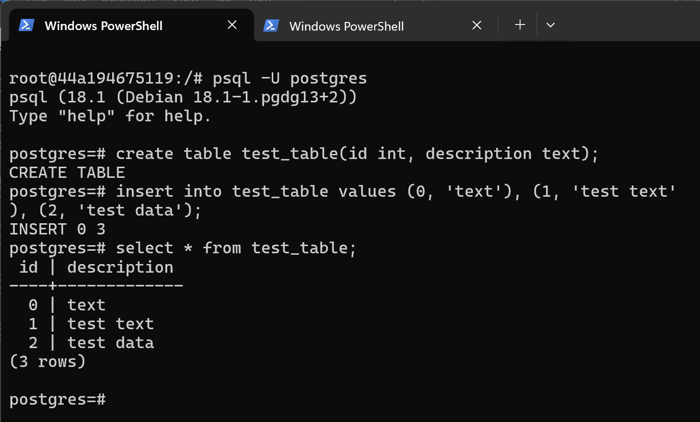

## Репликация базы данных PostgreSQL

# Физическая репликация.

База данных `master_db` и `replica_db` запускаются в docker контейнерах.



В базе данных `master_db` удостовериться, что настройка `listen_addresses = '*'` в файле postgresql.conf:



В базе данных `master_db` добавить настройку, позволяющую соединения в подсети контейнеров 172.17.0.0/16. Для этого:
1. Скопировать файл `pg_hba.conf` локально командой `docker cp aster_db:var/lib/postgresql/18/docker/pg_hba.conf ./pg_hba.conf`.
1. Внести в него требуемую настройку и скопировать обратно в контейнер.
1. Перезапустить контейнер и проверить, что настройка применилась:



В базе данных создать таблицу `test_table` и заполнить ее данными:
```sql
create table test_table(id int, description text);
insert into test_table values (0, 'text'), (1, 'test text'), (2, 'test data');
select * from test_table;
```
