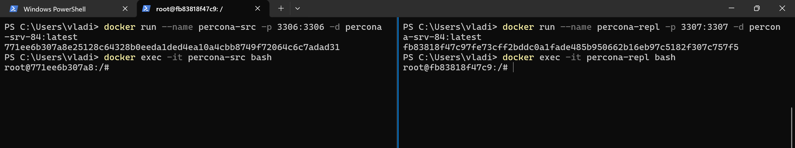
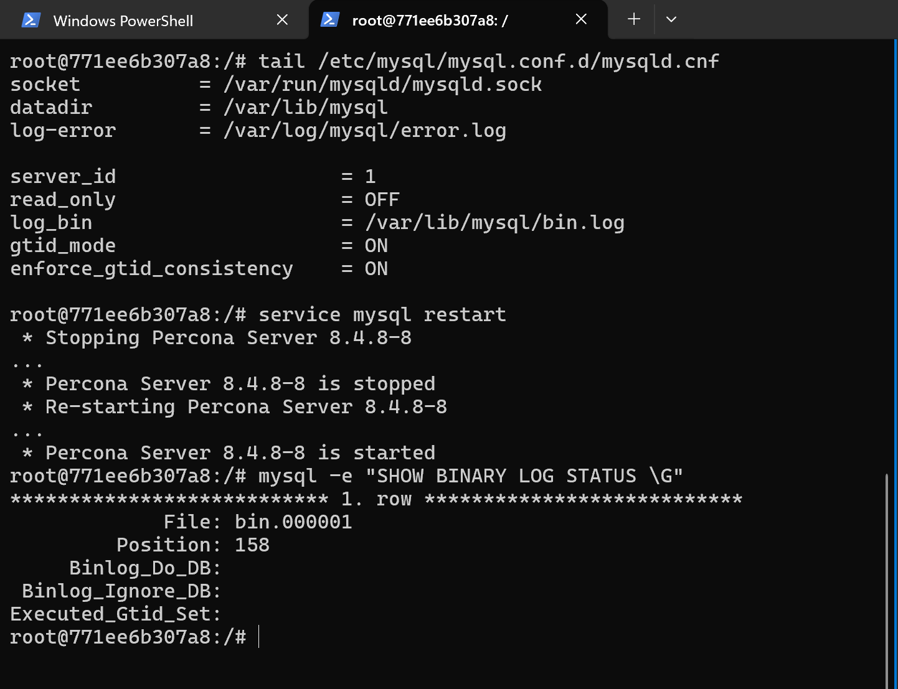
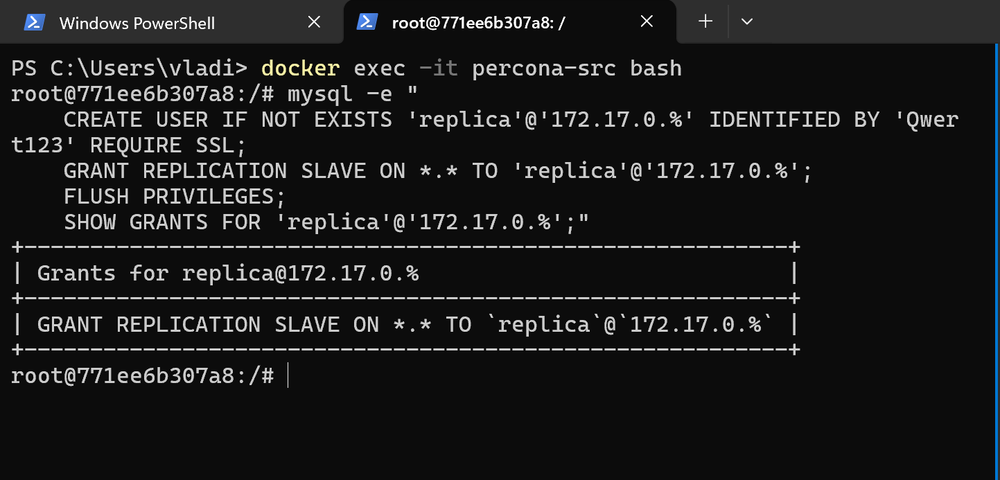
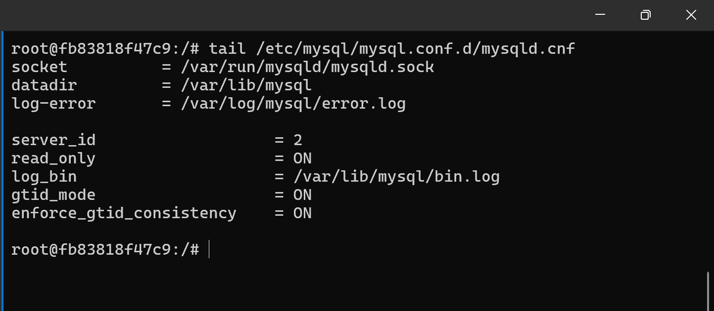
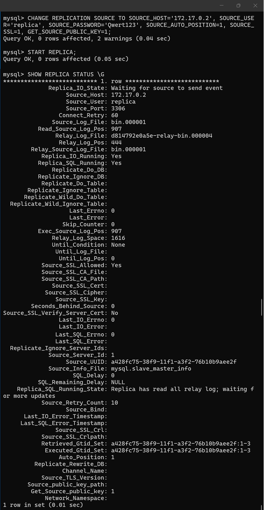
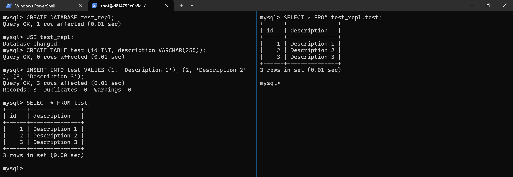

# Репликация MySQL

## Docker image
Создается кастомный Docker image на базе Ubuntu 22.04 с установленным Percona Server и другими необходимыми утилитами: [Dockerfile](../../MySQL/Docker/Replica/Dockerfile).

## Docker container
Docker image собирается и запускаются 2 контейнера: percona-src и percona-repl.
```sh
docker build -t percona-srv-84:latest .
```


## Настройка Source
* Сохранить конфигурацию Source сервера в файл `/etc/mysql/mysql.conf.d/mysqld.cnf`.
* Перезапустить сервер и проверить статус binary log:

* Создать пользователя для реплики:
```
mysql -e "
    CREATE USER IF NOT EXISTS 'replica'@'172.17.0.%' IDENTIFIED BY 'Qwert123' REQUIRE SSL;
    GRANT REPLICATION SLAVE ON *.* TO 'replica'@'172.17.0.%';
    FLUSH PRIVILEGES;
    SHOW GRANTS FOR 'replica'@'172.17.0.%';"
```


## Настройка Replica
* Сохранить конфигурацию Replica сервера в файл `/etc/mysql/mysql.conf.d/mysqld.cnf`.

* Настроить, запустить и проверить репликацию, выполнив команды:
```sql
CHANGE REPLICATION SOURCE TO
    SOURCE_HOST='172.17.0.2',
    SOURCE_USER='replica',
    SOURCE_PASSWORD='Qwert123',
    SOURCE_AUTO_POSITION=1,
    SOURCE_SSL=1,
    GET_SOURCE_PUBLIC_KEY=1;
START REPLICA;
SHOW REPLICA STATUS \G
```


## Проверить репликацию
Создать на сервере Source базу данных, таблицу и наполнить данными. На сервере Replica прочитать данные.
```sql
-- Source queries
CREATE DATABASE test_repl; 
USE test_repl; 
CREATE TABLE test (id INT, description VARCHAR(255)); 
INSERT INTO test VALUES (1, 'Description 1'), (2, 'Description 2'), (3, 'Description 3');
SELECT * FROM test;

-- Replica queries
SELECT * FROM test_repl.test;
```

