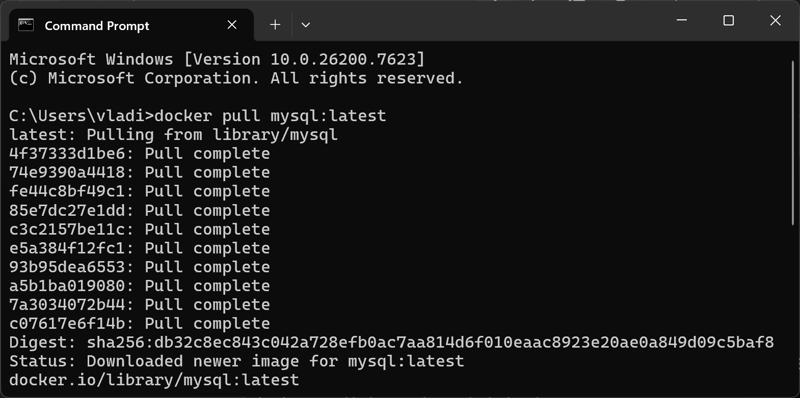
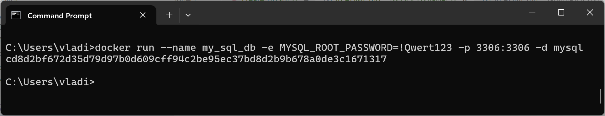
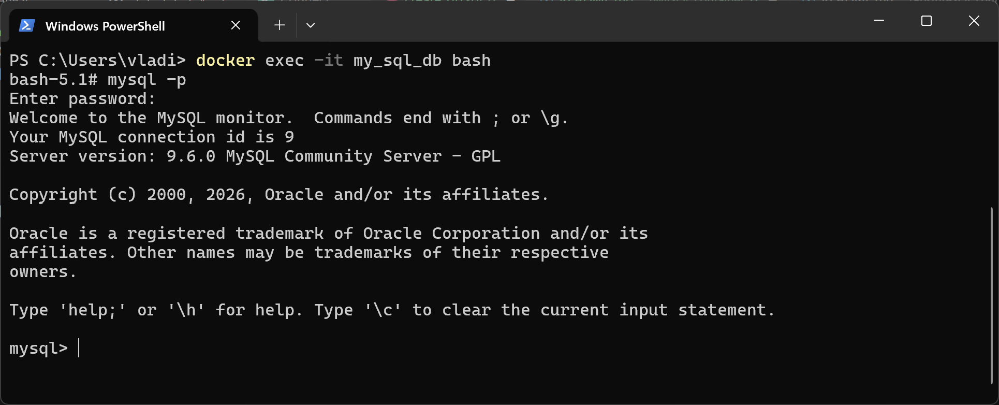
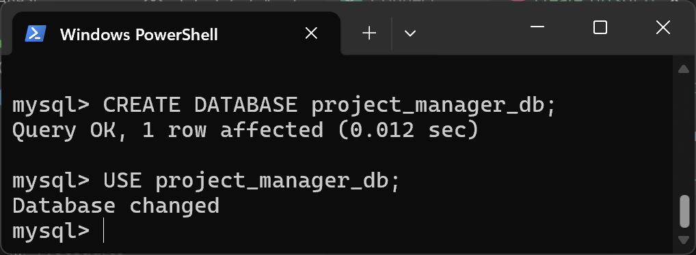
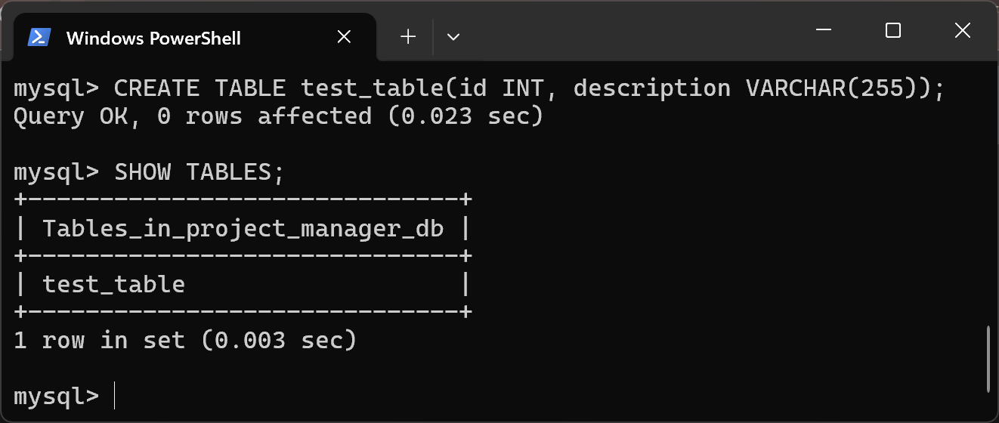
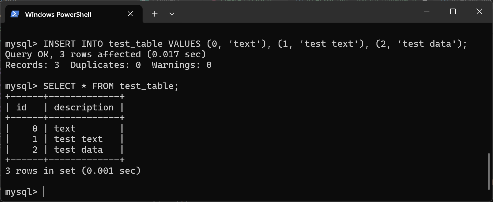

# MySQL Docker container

База данных запускается в контейнере Docker. Для этого необходимо сделать следующее:

Скачать образ mysql:



Запустить контейнер:



Подключить клиент:



Создать базу данных `project_manager_db` с помощью команд:
```sql
CREATE DATABASE project_manager_db;
USE project_manager_db;
```


Создать таблицу `test_table`:
```sql
CREATE TABLE test_table(id INT, description VARCHAR(255));
```



Наполнить её данными и прочитать их:
```sql
INSERT INTO test_table VALUES (0, 'text'), (1, 'test text'), (2, 'test data');
SELECT * FROM test_table;
```
