# Mongo DB
## MongoDB Docker контейнер
Получить `mongo` образ и запустить контейнер:

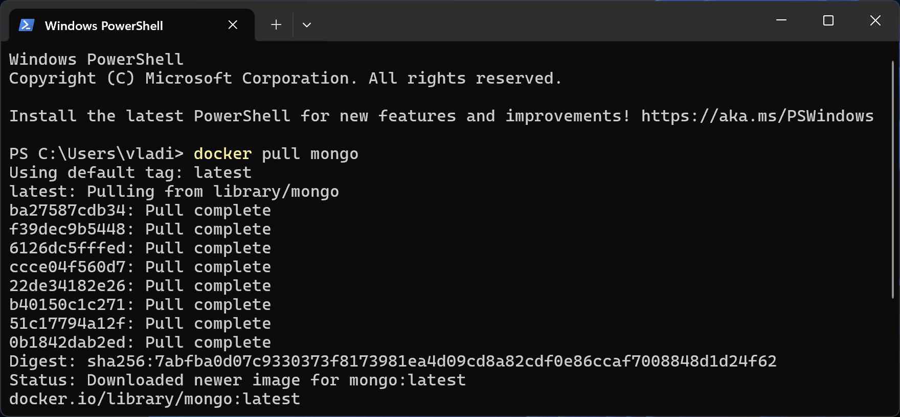

Запустить контейнер и войти в mongosh:

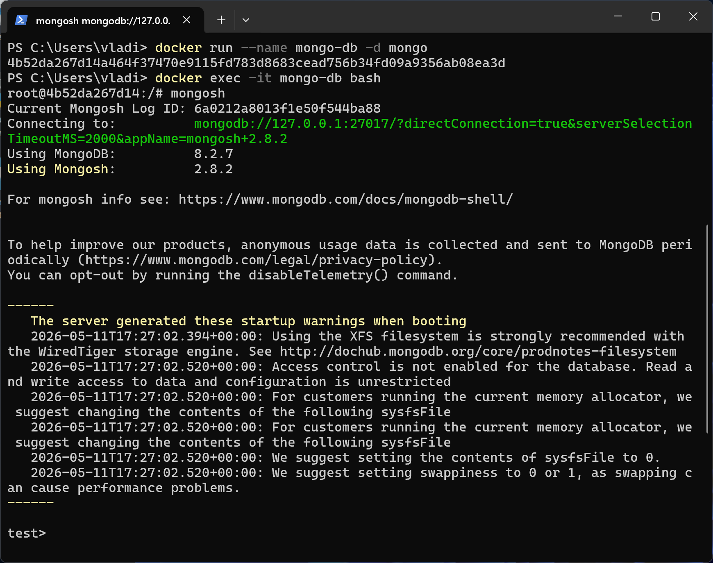

## Заполнение данными
Заполнить MongoDB демонстрационными данными. Создаются коллекции `users`, `projects`, `tasks` и наполняются данными.

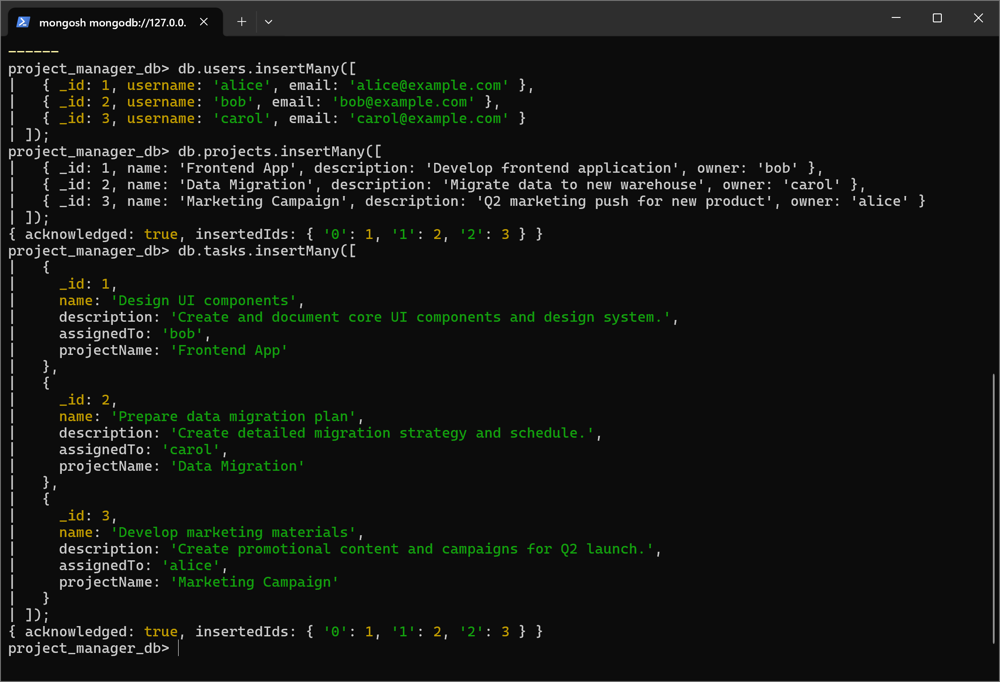

## Выборка данных
Получить всех пользователей:

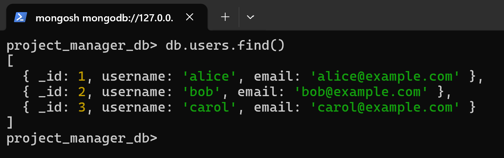

Задача пользователя `bob`:

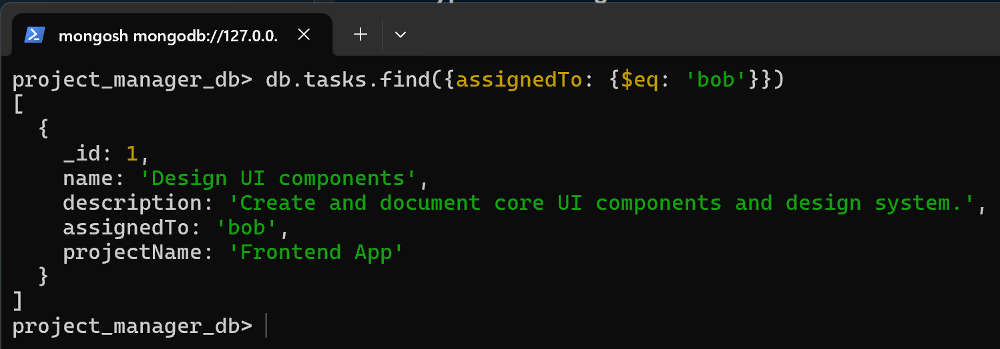

Найти проект, не принадлежащий пользователю `bob` и пропустить 1:

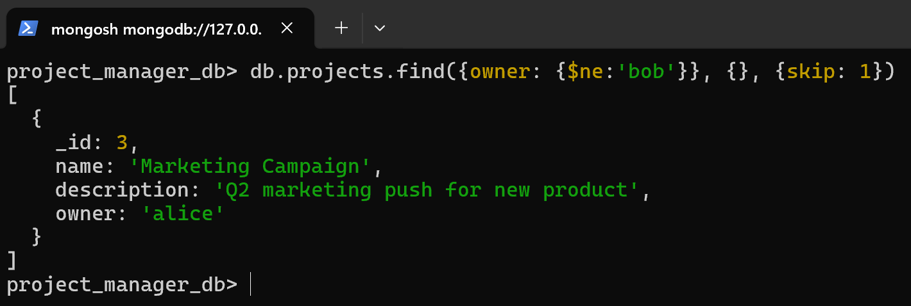

Найти задачу, принадлежащую проекту, чьё название начинвется на `Data`и не выводить поля `_id` и `descroption`:

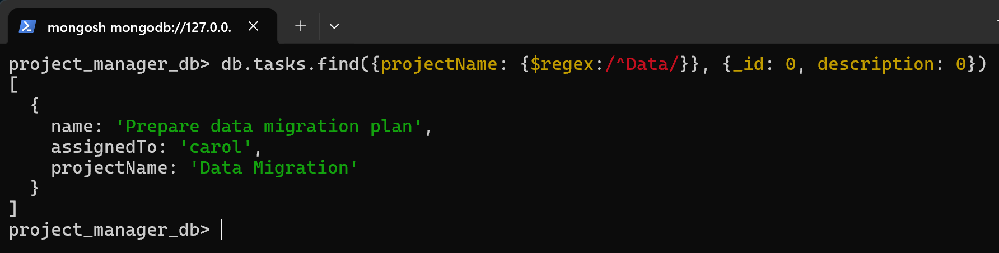

## Изменение данных:
Назначить задачу пользователя `bob` на `alice`:

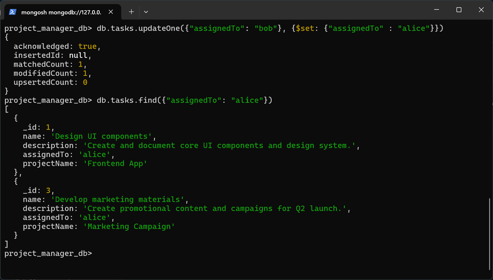

Добавить проектам новое поле `estimatedHoursSpent`:

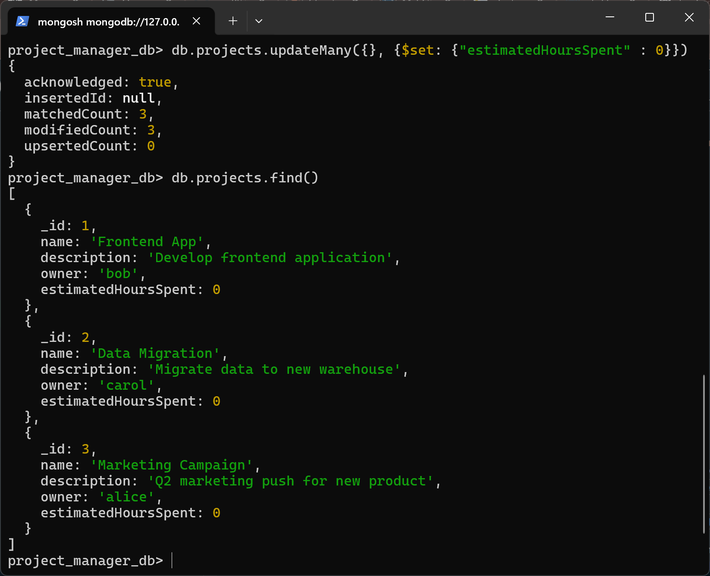

Удалить задачу, назначенную `carol`:

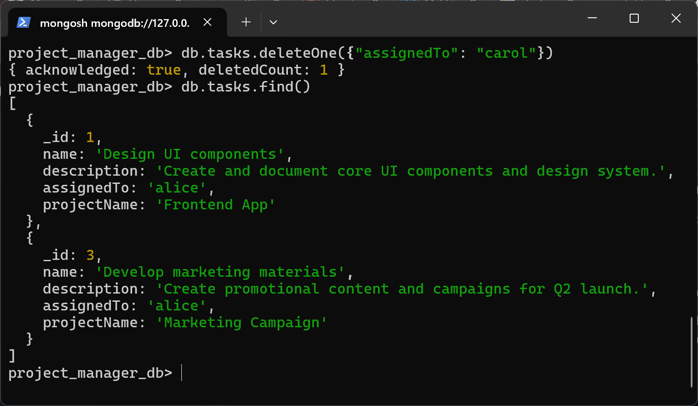

Удалить коллекцию задач:

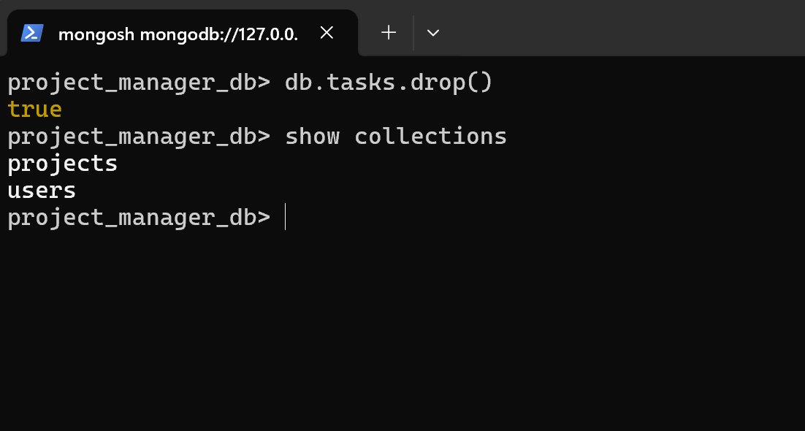