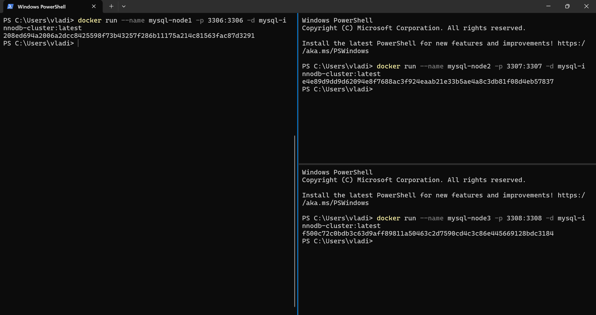
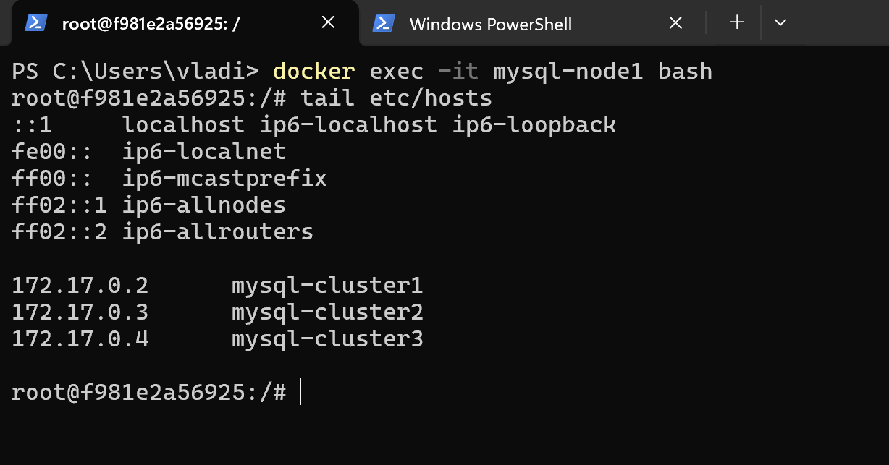

# InnoDB Cluster
## Docker image
Создается кастомный docker image на основе Ubuntu 22.04 [Dockerfile](../../../MySQL/Docker/InnoDB%20Cluster/Dockerfile).
```
docker build -t mysql-innodb-cluster .
```
Запускаются три контейнера `mysql-node1`, `mysql-node2`, `mysql-node3`, соответствующие узлам кластера.


## Конфигурирование узлов кластера
Конфигурируется `/etc/hosts`:


