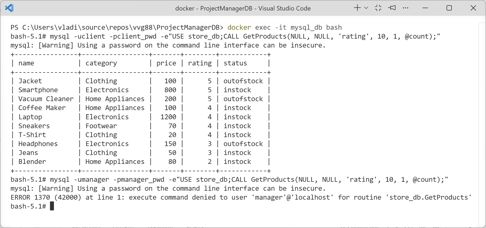
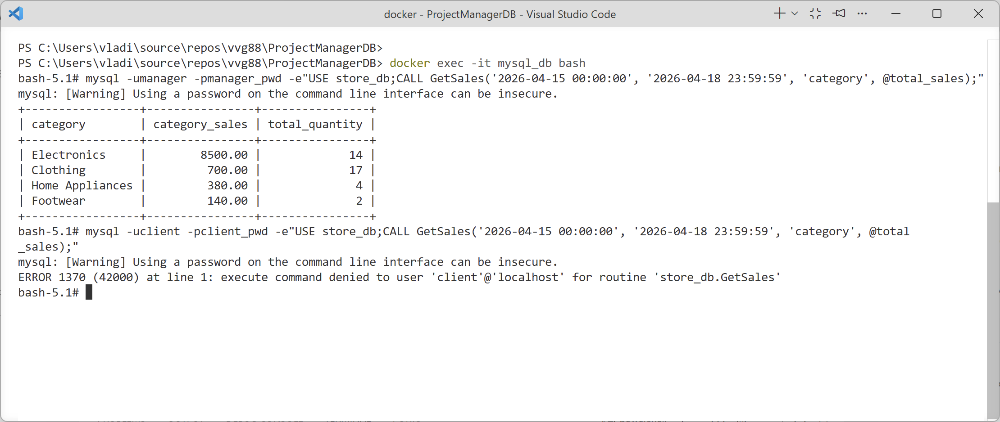

# Хранимые процедуры.
## GetProducts
Хранимая процедура GetProducts
```sql
GetProducts(
    IN category_name VARCHAR(32),
    IN status_name VARCHAR(32),
    IN order_by VARCHAR(10),
    IN products_per_page INT,
    IN page_number INT,
    OUT product_count INT)
```
Возвращает продукты постранично в соответствии с указанными параметрами фильтрации и сортировки. Процедура фильтрует продукты по категории и статусу (если указаны), сортирует результаты по цене, рейтингу или названию, и возвращает подмножество результатов в соответствии с параметрами пагинации. Также возвращает общее количество продуктов, соответствующих критериям фильтрации. 
Только пользователь `client` имеет права запускать её.
```sql
GRANT EXECUTE ON PROCEDURE store_db.GetProducts TO 'client'@'localhost';
```



## GetSales
Хранимая процедура GetSales
```sql
GetSales(
    IN start_date DATETIME,
    IN end_date DATETIME,
    IN group_by VARCHAR(10),
    OUT total_sales DECIMAL(10, 2))
```
Возвращает данные о продажах за указанный период с возможностью группировки по дате, продукту или категории. Процедура вычисляет общую сумму продаж за период, объединяет данные из таблиц продаж и информацией о категориях, и выводит результаты в соответствии с выбранным критерием группировки. Позволяет анализировать объемы продаж по разным признакам и отслеживать общую выручку.
Только пользователь `manager` имеет права запускать её.
```sql
GRANT EXECUTE ON PROCEDURE store_db.GetSales TO 'manager'@'localhost';
```


